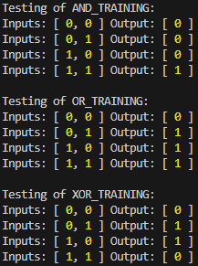

# Neural Network

# Training and Prediction

This project demonstrates how to train and predict using neural networks for logical functions (AND, OR, XOR).

## Requirements

Ensure you have the following software installed:

- Node.js v20.17.0
- npm v10.8.2

You can check your versions by running:

`node --version`

`npm --version`

## Installation

1. Clone the repository:

   `git clone https://github.com/git-pedromartinez/neural-network.git`

   `cd neural-network`

2. Install the required libraries:

   `npm install`

## Running the Scripts

Navigate to the folder `./src/examples/logical-functions/`

### Training the Networks

To train the neural networks, run:

`npx ts-node ./train-all-networks.ts`

### Predicting with the Networks

To make predictions using the trained networks, run:

`npx ts-node ./predict-all-networks.ts`

### Expected Results

## Project Structure

- `src/core/`: Contains the core neural network implementation.
- `src/examples/logical-functions/`: Contains the example scripts for training and predicting.
- `src/models/`: Contains the data models used in the project.
- `src/utils/`: Contains utility functions used throughout the project.

## License

This project is licensed under the MIT License and the GNU General Public License (GPL). See the [LICENSE-MIT](LICENSE-MIT) and [LICENSE-GPL](LICENSE-GPL) files for details.

**Author: Pedro Martinez**  
**Email: id.pedromartinez@gmail.com**  
**Position: Senior Software Engineer**
